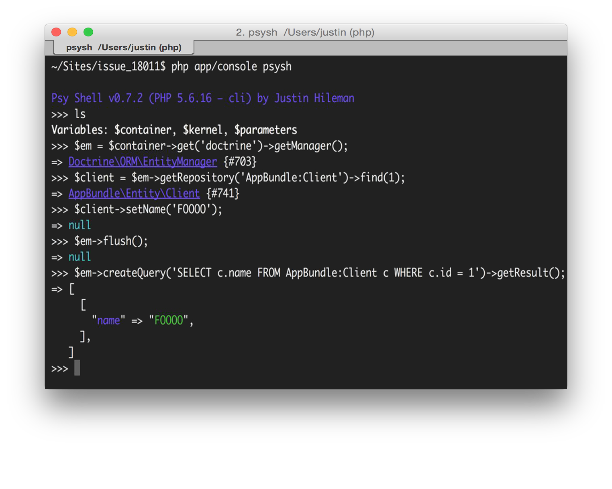

# PsyshBundle

[](https://packagist.org/packages/theofidry/psysh-bundle)
[](https://travis-ci.org/theofidry/PsyshBundle?branch=master)
[](https://insight.sensiolabs.com/projects/0dd96e9b-18b9-47f8-8ae0-762afb740110)
[](https://www.versioneye.com/user/projects/55802dee386664002000013a)
[](https://scrutinizer-ci.com/g/theofidry/PsyshBundle/?branch=master)
[](https://scrutinizer-ci.com/g/theofidry/PsyshBundle/?branch=master)

A bundle to use the php REPL [PsySH][1] with [Symfony][2]. Learn more at [psysh.org][1] and check out the [Interactive Debugging in PHP talk from OSCON](https://presentate.com/bobthecow/talks/php-for-pirates) on Presentate.

What does it do exactly?
* Loads [PsySH][1] with the application dependencies
* Gives access to the following variables:

| Variable              | Description                          |
|-----------------------|--------------------------------------|
| `$container`          | Instance of Symfony ServiceContainer |
| `$kernel`             | Instance of Symfony Kernel           |
| `$parameters`         | Instance of Symfony parameters       |

Aside from that it's the plain old [PsySH][1]! You can also [customize it](src/Resources/doc/custom.md) to add your own variables.


## Documentation

1. [Install](#install)
1. [PsySH as a debugger](src/Resources/doc/debugger.md)
2. [Reflect like a boss](src/Resources/doc/reflect.md)
3. [PsySH for breakpoints](src/Resources/doc/breakpoint.md)
4. [Customize PsySH](src/Resources/doc/custom.md)


## Install

You can use [Composer](https://getcomposer.org/) to install the bundle to your project:

```bash
composer require --dev theofidry/psysh-bundle
```

Then, enable the bundle by updating your `app/AppKernel.php` file to enable the bundle:
```php
<?php
// app/AppKernel.php

public function registerBundles()
{
    //...

    if (in_array($this->getEnvironment(), ['dev', 'test'])) {
        //...
        $bundles[] = new Fidry\PsyshBundle\PsyshBundle();
    }

    return $bundles;
}
```

## Usage

```bash
php app/console psysh

>> $client = $container->get('dummy.client')
>> $client->fetch()
```

or

```php
psysh()
```




## Credits

This bundle is developed by [Théo FIDRY](https://github.com/theofidry). This project has been made possible thanks to:

* [Justin Hileman](https://github.com/bobthecow): author of [PsySH][1] and [all the contributors of the PsySH project](https://github.com/bobthecow/psysh/graphs/contributors)
* [Adrian Palmer](https://github.com/navitronic): gave the lead for porting [PsySH][1] on [Symfony][2]


## License

[](LICENSE)

[1]: http://psysh.org/
[2]: http://symfony.com/
